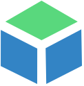
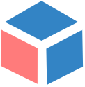
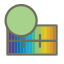
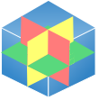
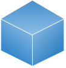
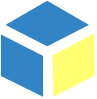

# itk-viewer-icons

[](https://badge.fury.io/js/itk-viewer-icons)

Icons for `itk-viewer` user interfaces.

## Installation

```
npm install --save itk-viewer-icons
```

## Example Usage

```
import { axesIconDataUri } from 'itk-viewer-icons'

iconElement = document.createElement('div')
iconElement.innerHTML = ``
```

## Icons Sources

Icons were created or collected from sources noted in their commit message.
Some icon sources can be found in the history of the viewer repository at
revision `f6b4fa13c8`, before they were extracted.

## Icon Renderings


<table>
  <tr>
    <th>annotationsIconDataUri</th>
    <th></th>
  </tr>
  <tr>
    <th>axesIconDataUri</th>
    <th></th>
  </tr>
  <tr>
    <th>blendModeIconDataUri</th>
    <th></th>
  </tr>
  <tr>
    <th>cropIconDataUri</th>
    <th></th>
  </tr>
  <tr>
    <th>fullscreenIconDataUri</th>
    <th></th>
  </tr>
  <tr>
    <th>geometryIconDataUri</th>
    <th></th>
  </tr>
  <tr>
    <th>gradientIconDataUri</th>
    <th></th>
  </tr>
  <tr>
    <th>greenPlaneIconDataUri</th>
    <th></th>
  </tr>
  <tr>
    <th>imageIconDataUri</th>
    <th></th>
  </tr>
  <tr>
    <th>interpolationIconDataUri</th>
    <th></th>
  </tr>
  <tr>
    <th>invisibleIconDataUri</th>
    <th></th>
  </tr>
  <tr>
    <th>labelsIconDataUri</th>
    <th></th>
  </tr>
  <tr>
    <th>lengthToolIconDataUri</th>
    <th></th>
  </tr>
  <tr>
    <th>opacityIconDataUri</th>
    <th></th>
  </tr>
  <tr>
    <th>pauseIconDataUri</th>
    <th></th>
  </tr>
  <tr>
    <th>playIconDataUri</th>
    <th></th>
  </tr>
  <tr>
    <th>pointSetIconDataUri</th>
    <th></th>
  </tr>
  <tr>
    <th>redPlaneIconDataUri</th>
    <th></th>
  </tr>
  <tr>
    <th>removeIconDataUri</th>
    <th></th>
  </tr>
  <tr>
    <th>resetCameraIconDataUri</th>
    <th></th>
  </tr>
  <tr>
    <th>resetCropIconDataUri</th>
    <th></th>
  </tr>
  <tr>
    <th>rotateIconDataUri</th>
    <th></th>
  </tr>
  <tr>
    <th>sampleDistanceIconDataUri</th>
    <th></th>
  </tr>
  <tr>
    <th>scaleSelectIconDataUri</th>
    <th></th>
  </tr>
  <tr>
    <th>screenshotIconDataUri</th>
    <th></th>
  </tr>
  <tr>
    <th>selectColorIconDataUri</th>
    <th></th>
  </tr>
  <tr>
    <th>shadowIconDataUri</th>
    <th></th>
  </tr>
  <tr>
    <th>toggleIconDataUri</th>
    <th></th>
  </tr>
  <tr>
    <th>viewPlanesIconDataUri</th>
    <th></th>
  </tr>
  <tr>
    <th>visibleIconDataUri</th>
    <th></th>
  </tr>
  <tr>
    <th>volumeIconDataUri</th>
    <th></th>
  </tr>
  <tr>
    <th>yellowPlaneIconDataUri</th>
    <th></th>
  </tr>
</table>
